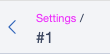

# SomeConfig Breadcrumbs Issue Repro

Minimal Silverstripe CMS 6 project to reproduce the breadcrumb bug in [jonom/silverstripe-someconfig](https://github.com/jonom/silverstripe-someconfig).

[Issue #2](https://github.com/jonom/silverstripe-someconfig/issues/2#issuecomment-4096864744) · [PR #8](https://github.com/jonom/silverstripe-someconfig/pull/8)

## The Bug

`SomeConfig` settings breadcrumbs break when the config class is namespaced (e.g. `App\Models\JobDefaults`). The upstream code parses the class name from the URL using `explode('/')`, but namespaced classes get URL-encoded with hyphens (`App-Models-JobDefaults`), which doesn't match as a valid class for `method_exists()`.

## Quick Start (GitHub Codespaces)

1. Open this repo in a Codespace
2. Wait for setup to complete (`composer install` + `db:build` runs automatically)
3. Open the forwarded port (8888) in your browser
4. Log in at `/admin` with **admin** / **password**
5. Click **Jobs** in the left menu
6. Click the **Settings** tab
7. Note: you need to explicitly click the fuchsia-highlighted **Settings** link in the breadcrumbs (see screenshot below)

   

The breadcrumbs will be wrong — the back link points to the wrong URL.

## Project Structure

```
app/src/
  Admin/JobsAdmin.php      # ModelAdmin using SomeConfigAdmin trait
  Models/JobPosting.php     # Simple DataObject (first managed model)
  Models/JobDefaults.php    # DataObject using SomeConfig trait (settings tab)
```

## Fix (PR #8)

To test with the fix applied, update `composer.json`:

```json
{
    "repositories": [
        {
            "type": "vcs",
            "url": "https://github.com/lerni/silverstripe-someconfig"
        }
    ],
    "require": {
        "jonom/silverstripe-someconfig": "dev-breadcrumbs-namespaced-classes as 2.0.1"
    }
}
```

Then run `composer update jonom/silverstripe-someconfig`.
